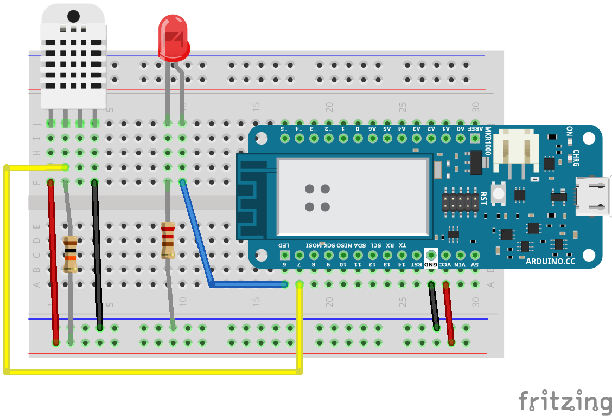

# Building Wi-Fi Connected Devices with Arduino
Hackaday Superconference Workshop - November 4, 2018

## Arduino IDE
Install the Arduino IDE from https://arduino.cc/downloads
        
### Arduino SAMD Board Definitions
Install the Arduino SAMD Board definitions. Use menu /Tools -> Boards -> Boards Manager/ and search for "1010"
        
### Arduino Libraries        
Install the following Arduino Libraries using the Library manager. Menu /Sketch -> Include Libraries -> Manage Libraries/

    * WiFiNINA library (search for "NINA")
    * Joël Gähwiler's MQTT library (search for "lwmqtt")
    * DHT sensor library by Adafruit (search for "DHT")
    * Adafruit Unified Sensor library (search for "adafruit abstraction")

## Wiring

Suggested wiring instructions:

1. Place the solderless breadboard with A1 on the bottom left.
1. Plug the Arduino MKR WiFi 1010 into the breadboard with the 5V pin in C30.
1. Plug the DHT-22 into J1.
   * Use a red wire from the positive rail to F1
   * Put a 10,000 &#937; resistor from the positive rail to F2.
   * Place a black wire from the negative rail to F4
   * Run a yellow wire from G2 to A18 which is pin 7 on the Arduino.
1. Plug the LED into J9 and J10. Make sure the longer leg is in J10.
   * Run a 220 &#937; resistor from the negative rail to F9
   * Run a blue wire from F10 to A17 which is pin 6 on the Arduino.
1. Run a black wire from A27 to the negative rail
1. Run a red wire from A28 to the positive rail

## Slides

The slides are avaialble from https://don.github.io/slides/2018-11-04-superconf-iot-workshop